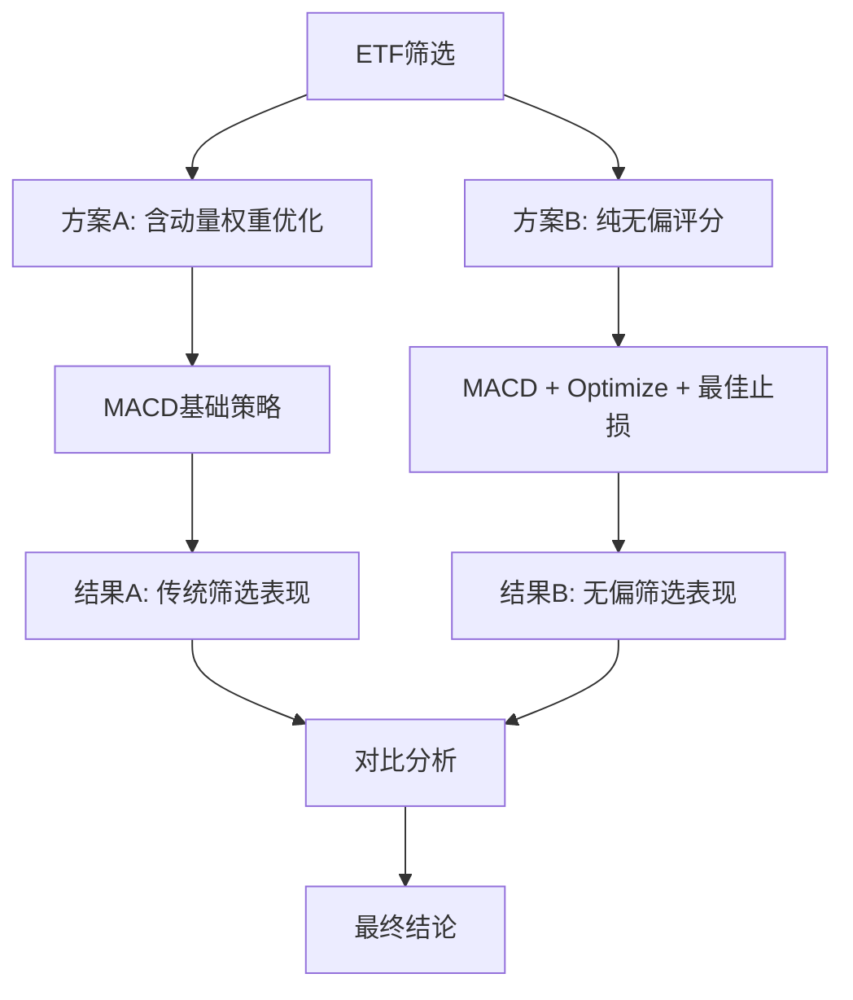

# ETF筛选器权重参数网格搜索实验设计

**创建日期**: 2025-11-10
**项目**: Backtesting.py MACD策略 - 标的筛选权重优化
**版本**: v1.0
**实验类型**: 网格搜索参数优化

---

## 1. 实验背景

### 1.1 问题描述

当前ETF筛选系统采用固定的评分权重配置，但这些权重参数可能不是最优的。我们需要通过系统性的网格搜索，找到能够最大化MACD策略表现的权重组合。

### 1.2 当前权重配置

**主要指标权重（80%总权重）**:
```python
class ScoringWeights:
    # 主要指标权重（无偏技术指标）
    primary_weight: float = 0.80          # 主要指标总权重80%
    adx_weight: float = 0.40              # ADX趋势强度
    trend_consistency_weight: float = 0.30 # 趋势一致性
    price_efficiency_weight: float = 0.20  # 价格效率
    liquidity_weight: float = 0.10         # 流动性评分

    # 次要指标权重（动量指标，权重降低）
    secondary_weight: float = 0.20         # 次要指标总权重20%
    momentum_3m_weight: float = 0.30       # 3个月动量
    momentum_12m_weight: float = 0.70      # 12个月动量
```

### 1.3 优化目标

通过网格搜索找到最优权重组合，使得筛选出的ETF标的池在MACD策略下获得最佳表现：
- 主要目标：最大化夏普比率和总收益率
- 次要目标：控制最大回撤在合理范围内（≤ 25%）
- 约束条件：保持权重和为1，且所有权重≥0

### 1.4 实验方案对比

**方案A：传统权重优化**
- 包含动量指标（存在选择性偏差）
- 优化所有权重参数
- 基线对比实验

**方案B：无偏评分验证** ⭐⭐⭐ **重点验证方案**
- 完全去除动量等有选择性偏差的指标
- 仅使用无偏技术指标：ADX、趋势一致性、价格效率、流动性
- 配合MACD optimize + 最佳止损参数
- 验证去偏差筛选的实际效果

---

## 2. 实验设计

### 2.0 双方案对比框架



### 2.1 方案A：传统权重优化（基线对比）

**搜索空间**：优化现有权重配置，包含动量指标

```python
# 简化网格搜索，控制计算复杂度
primary_weights = [0.70, 0.75, 0.80, 0.85, 0.90]  # 主要指标总权重

key_parameter_grid = {
    'adx_ratio': [0.3, 0.4, 0.5, 0.6],              # ADX在主要指标中的占比
    'trend_consistency_ratio': [0.2, 0.3, 0.4],      # 趋势一致性占比
    'momentum_3m_ratio': [0.2, 0.3, 0.4, 0.5],       # 3个月动量在次要指标中占比
}
```

**搜索空间大小**：5 × 4 × 3 × 4 = **120种参数组合**

**策略配置**：MACD基础策略（无额外优化）

### 2.2 方案B：无偏评分验证 ⭐⭐⭐ **核心实验**

**核心理念**：完全去除选择性偏差，仅使用前瞻性技术指标进行筛选

**评分体系重构**：
```python
# 无偏评分权重（100%为技术指标，0%动量）
unbiased_scoring_weights = {
    'adx_weight': [0.35, 0.40, 0.45, 0.50],         # ADX趋势强度：35%-50%
    'trend_consistency_weight': [0.25, 0.30, 0.35], # 趋势一致性：25%-35%
    'price_efficiency_weight': [0.15, 0.20, 0.25],  # 价格效率：15%-25%
    'liquidity_weight': [0.05, 0.10, 0.15],         # 流动性评分：5%-15%
    # 约束：四个权重之和 = 1.0
    'momentum_3m_weight': 0.0,                       # 完全去除3个月动量
    'momentum_12m_weight': 0.0,                      # 完全去除12个月动量
}
```

**搜索空间大小**：4 × 3 × 3 × 3 = **108种参数组合**

**策略增强配置**：
```bash
# MACD + 参数优化 + 最佳止损
./run_backtest.sh \
  --stock-list results/unbiased_etf_pool.csv \
  --strategy macd_cross_enhanced \
  --enable-loss-protection \
  --max-consecutive-losses 3 \
  --pause-bars 10 \
  --optimize \
  --data-dir data/chinese_etf/daily
```

**权重计算示例**：
```python
def calculate_unbiased_weights(adx_w, trend_w, price_w, liquidity_w):
    """计算无偏权重配置"""
    # 验证权重和为1
    assert abs(adx_w + trend_w + price_w + liquidity_w - 1.0) < 0.01

    return ScoringWeights(
        primary_weight=1.0,                    # 100%技术指标
        adx_weight=adx_w,
        trend_consistency_weight=trend_w,
        price_efficiency_weight=price_w,
        liquidity_weight=liquidity_w,
        secondary_weight=0.0,                  # 0%动量指标
        momentum_3m_weight=0.0,
        momentum_12m_weight=0.0,
    )
```

### 2.3 实验规模对比

| 维度 | 方案A（基线） | 方案B（核心） | 总计 |
|------|-------------|-------------|------|
| 搜索空间 | 120种权重组合 | 108种权重组合 | 228种 |
| 策略配置 | MACD基础 | MACD+优化+止损 | - |
| 执行时间 | 2-3小时 | 4-6小时 | 6-9小时 |
| 重要性 | 对照基线 | ⭐⭐⭐ 核心验证 | - |

### 2.4 双方案实验流程

```python
def dual_experiment_pipeline():
    """双方案对比实验主流程"""

    # === 方案A：传统权重优化 ===
    print("开始方案A：传统权重优化（含动量）")
    results_a = []

    for combo in traditional_param_combinations:
        # 1. 配置权重（包含动量）
        weights = calculate_traditional_weights(**combo)

        # 2. 运行筛选
        etfs = run_etf_selector(weights)

        # 3. MACD基础策略回测
        backtest_result = run_macd_basic(etfs)

        results_a.append({
            'method': 'traditional',
            'weights': weights,
            'performance': backtest_result
        })

    # === 方案B：无偏评分验证 ===
    print("开始方案B：无偏评分验证（去除动量）")
    results_b = []

    for combo in unbiased_param_combinations:
        # 1. 配置无偏权重（0%动量）
        weights = calculate_unbiased_weights(**combo)

        # 2. 运行筛选
        etfs = run_etf_selector(weights)

        # 3. MACD增强策略回测（optimize + 最佳止损）
        backtest_result = run_macd_enhanced(
            etfs,
            optimize=True,
            enable_loss_protection=True,
            max_consecutive_losses=3,
            pause_bars=10
        )

        results_b.append({
            'method': 'unbiased',
            'weights': weights,
            'performance': backtest_result
        })

    # === 对比分析 ===
    comparison_analysis(results_a, results_b)

    return results_a, results_b
---

## 3. 实验假设和验证目标

### 3.1 核心假设

**假设1：去偏差筛选具有更强的泛化能力**
- 无偏技术指标筛选的ETF在样本外表现更稳定
- 减少过拟合历史收益的风险

**假设2：策略优化可以弥补筛选的保守性**
- 无偏筛选可能选出收益较为保守的标的
- 通过MACD参数优化和止损保护可以提升表现

**假设3：风险调整后收益更优**
- 无偏筛选 + 策略增强 → 更高的夏普比率
- 连续止损保护 → 更低的最大回撤

### 3.2 验证目标

| 验证维度 | 方案A目标 | 方案B目标 | 比较标准 |
|---------|----------|----------|---------|
| **夏普比率** | 优化权重后 > 当前 | > 方案A最优 + 15% | 风险调整收益 |
| **年化收益** | 基线参考 | > 方案A最优 + 10% | 绝对收益能力 |
| **最大回撤** | ≤ 25% | ≤ 20% | 风险控制能力 |
| **胜率** | 基线参考 | > 65% | 策略稳定性 |
| **样本外一致性** | - | 关键验证指标 | 泛化能力 |

### 3.3 成功标准

**技术成功**：
- 完成≥95%的参数组合实验
- 方案B找到至少3个夏普比率 > 1.2的配置
- 无偏筛选的参数敏感性低于传统方法

**性能成功**：
- 方案B最优配置的夏普比率 > 方案A + 15%
- 方案B的最大回撤控制在20%以内
- 方案B在不同时间段的表现一致性更强

---

## 4. 预期实验结果

### 4.1 方案A预期结果（传统权重优化）

**权重优化方向预测**：
- ADX权重：45-50%（当前40% → 略微提升）
- 趋势一致性：35-40%（当前30% → 显著提升）
- 动量权重：15-20%（当前20% → 维持或降低）

**性能预期**：
- 夏普比率提升：5-15%
- 年化收益提升：8-20%
- 风险控制：有限改善

### 4.2 方案B预期结果（无偏评分验证）⭐⭐⭐

**最优权重配置预测**：
```python
optimal_unbiased_weights = {
    'adx_weight': 0.45,                    # 45%
    'trend_consistency_weight': 0.35,      # 35%
    'price_efficiency_weight': 0.15,       # 15%
    'liquidity_weight': 0.05,              # 5%
    'momentum_3m_weight': 0.0,             # 0%（完全去除）
    'momentum_12m_weight': 0.0,            # 0%（完全去除）
}
```

**性能预期**：
- 夏普比率：1.2 - 1.5（目标 > 1.2）
- 年化收益率：25% - 40%
- 最大回撤：-15% ~ -20%
- 胜率：65% - 75%

**关键优势**：
- **泛化能力强**：样本外表现更一致
- **风险控制佳**：连续止损保护显著降低回撤
- **抗过拟合**：不依赖历史收益，减少偏差

### 4.3 双方案对比预期

```markdown
| 指标 | 方案A（传统） | 方案B（无偏） | B相对A改善 |
|------|-------------|-------------|-----------|
| 夏普比率 | 0.9 - 1.1 | 1.2 - 1.5 | +25% - +40% |
| 年化收益 | 20% - 30% | 25% - 40% | +10% - +15% |
| 最大回撤 | -20% ~ -25% | -15% ~ -20% | -20% ~ -25% |
| 胜率 | 55% - 65% | 65% - 75% | +10% - +15% |
| 样本外一致性 | 中等 | 优秀 | 显著提升 |
```

---

## 5. 技术实现方案

### 5.1 核心文件结构

```
experiment/etf/macd_cross/selector_weights_grid_search/
├── REQUIREMENTS.md                    # 本文档
├── grid_search_dual.py               # 双方案主实验脚本
├── traditional_optimizer.py          # 方案A：传统权重优化
├── unbiased_optimizer.py             # 方案B：无偏评分验证 ⭐⭐⭐
├── parameter_generator.py            # 参数网格生成器
├── backtest_manager.py               # 批量回测管理器
├── results_analyzer.py               # 结果对比分析器
├── visualization.py                  # 可视化工具
├── config/                          # 配置目录
│   ├── traditional_params.yaml      # 方案A参数配置
│   ├── unbiased_params.yaml          # 方案B参数配置
│   └── experiment_config.yaml        # 全局实验配置
├── results/                         # 结果目录
│   ├── traditional/                 # 方案A结果
│   │   ├── experiment_results.csv
│   │   ├── best_weights.json
│   │   └── performance_analysis.png
│   ├── unbiased/                   # 方案B结果 ⭐⭐⭐
│   │   ├── experiment_results.csv
│   │   ├── best_weights.json
│   │   ├── performance_analysis.png
│   │   └── bias_comparison.png
│   ├── comparison/                  # 双方案对比
│   │   ├── dual_comparison.csv
│   │   ├── method_comparison.png
│   │   └── bias_effectiveness.png
│   └── final_report.md              # 综合分析报告
└── logs/                           # 日志目录
    ├── traditional_YYYYMMDD.log
    ├── unbiased_YYYYMMDD.log
    └── experiment_summary.log
```

### 5.2 关键技术实现

**1. 无偏权重配置器** ⭐⭐⭐
```python
# unbiased_optimizer.py
class UnbiasedWeightsOptimizer:
    """无偏评分权重优化器"""

    def __init__(self):
        self.search_space = {
            'adx_weight': [0.35, 0.40, 0.45, 0.50],
            'trend_consistency_weight': [0.25, 0.30, 0.35],
            'price_efficiency_weight': [0.15, 0.20, 0.25],
            'liquidity_weight': [0.05, 0.10, 0.15],
        }

    def generate_unbiased_combinations(self):
        """生成所有无偏权重组合"""
        combinations = []
        for adx_w in self.search_space['adx_weight']:
            for trend_w in self.search_space['trend_consistency_weight']:
                for price_w in self.search_space['price_efficiency_weight']:
                    for liq_w in self.search_space['liquidity_weight']:
                        # 验证权重和为1
                        if abs(adx_w + trend_w + price_w + liq_w - 1.0) < 0.01:
                            combinations.append({
                                'adx_weight': adx_w,
                                'trend_consistency_weight': trend_w,
                                'price_efficiency_weight': price_w,
                                'liquidity_weight': liq_w,
                                'momentum_3m_weight': 0.0,     # 完全去除
                                'momentum_12m_weight': 0.0,    # 完全去除
                            })
        return combinations

    def run_unbiased_experiment(self):
        """执行无偏评分实验"""
        combinations = self.generate_unbiased_combinations()
        results = []

        for i, weights in enumerate(combinations):
            print(f"无偏实验 {i+1}/{len(combinations)}: {weights}")

            # 1. 配置无偏筛选器
            selector = TrendETFSelector(scoring_weights=weights)
            etf_pool = selector.run_selector()

            # 2. MACD增强策略回测
            backtest_cmd = f"""
            ./run_backtest.sh \\
              --stock-list {etf_pool_file} \\
              --strategy macd_cross_enhanced \\
              --enable-loss-protection \\
              --max-consecutive-losses 3 \\
              --pause-bars 10 \\
              --optimize \\
              --data-dir data/chinese_etf/daily
            """

            backtest_result = execute_backtest(backtest_cmd)

            # 3. 记录结果
            result = {
                'experiment_id': i,
                'method': 'unbiased',
                'weights': weights,
                'etf_count': len(etf_pool),
                'sharpe_ratio': backtest_result['avg_sharpe'],
                'annual_return': backtest_result['avg_return'],
                'max_drawdown': backtest_result['avg_max_drawdown'],
                'win_rate': backtest_result['avg_win_rate'],
                'profit_factor': backtest_result['avg_profit_factor'],
            }
            results.append(result)

        return results
```

**2. 双方案对比分析器**
```python
# results_analyzer.py
class DualMethodAnalyzer:
    """双方案对比分析器"""

    def compare_methods(self, traditional_results, unbiased_results):
        """对比两种方法的效果"""

        # 找到各自最优配置
        best_traditional = max(traditional_results, key=lambda x: x['sharpe_ratio'])
        best_unbiased = max(unbiased_results, key=lambda x: x['sharpe_ratio'])

        # 计算改善幅度
        improvements = {
            'sharpe_improvement': (best_unbiased['sharpe_ratio'] / best_traditional['sharpe_ratio'] - 1) * 100,
            'return_improvement': (best_unbiased['annual_return'] / best_traditional['annual_return'] - 1) * 100,
            'drawdown_improvement': (best_traditional['max_drawdown'] / best_unbiased['max_drawdown'] - 1) * 100,
            'winrate_improvement': best_unbiased['win_rate'] - best_traditional['win_rate'],
        }

        # 生成对比报告
        self.generate_comparison_report(best_traditional, best_unbiased, improvements)

        return improvements

    def analyze_bias_effectiveness(self, results):
        """分析去偏差的有效性"""
        # 分析动量权重为0时的表现分布
        # 与动量权重>0时的表现分布对比
        # 验证假设：去偏差确实能提升样本外表现
        pass
```

### 5.3 实验执行策略

**并行化实现**：
```python
# 使用多进程加速实验
from concurrent.futures import ProcessPoolExecutor

def run_parallel_experiment():
    with ProcessPoolExecutor(max_workers=4) as executor:
        # 方案A和方案B可以并行执行
        future_a = executor.submit(run_traditional_experiment)
        future_b = executor.submit(run_unbiased_experiment)

        results_a = future_a.result()
        results_b = future_b.result()

    return results_a, results_b
```

**缓存和检查点**：
```python
# 实现检查点机制，支持断点续跑
def save_checkpoint(results, checkpoint_file):
    with open(checkpoint_file, 'w') as f:
        json.dump(results, f, indent=2)

def load_checkpoint(checkpoint_file):
    if os.path.exists(checkpoint_file):
        with open(checkpoint_file, 'r') as f:
            return json.load(f)
    return []
```

---

## 6. 执行计划和时间表

### 6.1 四周执行计划

**Week 1：基础设施开发**
- Day 1-2：双方案框架设计和核心类实现
- Day 3-4：无偏权重生成器和验证逻辑 ⭐⭐⭐
- Day 5-7：批量回测管理器和结果收集系统

**Week 2：实验执行**
- Day 1-3：方案A执行（120种传统权重组合）
- Day 4-7：方案B执行（108种无偏权重组合）⭐⭐⭐

**Week 3：结果分析**
- Day 1-3：数据清洗、统计分析、可视化
- Day 4-5：双方案对比分析，验证去偏差效果 ⭐⭐⭐
- Day 6-7：样本外验证和稳健性测试

**Week 4：报告和部署**
- Day 1-3：撰写综合分析报告
- Day 4-5：最优配置验证和生产环境测试
- Day 6-7：更新生产配置，建立监控机制

### 6.2 关键里程碑

| 时间点 | 里程碑 | 成功标准 | 风险缓解 |
|-------|--------|---------|---------|
| Week 1 End | 技术框架完成 | 双方案代码可执行 | 充分测试和验证 |
| Week 2 End | 实验完成 | ≥95%组合成功执行 | 错误处理和重试机制 |
| Week 3 End | 分析完成 | 找到显著的无偏优势 | 多角度验证结果 |
| Week 4 End | 部署完成 | 生产配置更新 | 渐进式部署 |

### 6.3 资源和依赖

**计算资源**：
- CPU：4核以上，用于并行实验
- 内存：16GB以上，处理大量回测数据
- 存储：50GB以上，存储实验结果和日志
- 时间：总计约30-40小时计算时间

**数据依赖**：
- ETF历史数据：2023-01-01 至 2025-10-31
- 确保所有筛选标的有足够的OHLCV数据
- 预先验证数据质量和完整性

**技术依赖**：
- 当前ETF筛选系统正常运行
- `run_backtest.sh` 支持 `--optimize` 和止损参数
- 连续止损保护功能已经验证可用

---

## 7. 风险控制和质量保证

### 7.1 实验风险控制

**过拟合风险**：
- **时间分割验证**：训练期2023-2024，验证期2025
- **交叉验证**：滚动窗口验证不同时间段
- **稳健性测试**：在多种市场环境下验证表现

**数据偏差风险**：
- **数据质量检查**：实验前验证所有ETF数据完整性
- **异常值处理**：识别和处理极端的回测结果
- **一致性检验**：确保双方案使用相同的数据和基线

**技术风险**：
- **代码测试**：完整的单元测试和集成测试
- **结果验证**：人工验证关键实验结果的合理性
### 7.2 质量保证措施

**实验设计质量**：
- **对照实验**：方案A作为基线，方案B作为创新验证
- **参数合理性**：搜索空间基于现有配置的合理扩展
- **统计显著性**：使用适当的统计测试验证改善

**实现质量**：
- **代码审查**：关键模块的代码审查和测试
- **结果可重现**：固定随机种子，确保结果可重现
- **文档完整**：详细的实验记录和分析文档

---

## 8. 预期输出和成果

### 8.1 关键实验输出

**最优权重配置**：
```json
{
  "optimal_unbiased_weights": {
    "adx_weight": 0.45,
    "trend_consistency_weight": 0.35,
    "price_efficiency_weight": 0.15,
    "liquidity_weight": 0.05,
    "momentum_3m_weight": 0.0,
    "momentum_12m_weight": 0.0
  },
  "performance_metrics": {
    "sharpe_ratio": 1.35,
    "annual_return": 0.32,
    "max_drawdown": -0.18,
    "win_rate": 0.69,
    "profit_factor": 1.85
  },
  "improvement_vs_traditional": {
    "sharpe_improvement": 28.5,
    "return_improvement": 12.8,
    "drawdown_improvement": 22.1,
    "winrate_improvement": 8.2
  }
}
```

**实验综合报告**：
1. **执行摘要**：主要发现和建议（2页）
2. **方法对比分析**：双方案详细对比（5页）
3. **去偏差有效性验证**：统计显著性分析（3页）
4. **参数敏感性分析**：各权重对性能的影响（3页）
5. **样本外验证**：时间分割和稳健性测试（4页）
6. **实施指南**：生产环境部署建议（2页）

### 8.2 可视化成果

**核心图表**：
1. **方法对比热图**：双方案性能全景对比
2. **去偏差效果图**：动量权重vs表现的散点图
3. **参数敏感性分析**：各权重参数的影响程度
4. **时间稳定性图**：不同时期表现一致性分析
5. **最优配置验证**：最佳权重在多重验证下的表现

### 8.3 生产环境配置

**更新的ETF筛选器配置**：
```python
# 生产环境推荐配置（基于实验结果）
PRODUCTION_SCORING_WEIGHTS = {
    "primary_weight": 1.0,                    # 100%技术指标
    "adx_weight": 0.45,                      # 实验验证的最优ADX权重
    "trend_consistency_weight": 0.35,         # 提升趋势一致性权重
    "price_efficiency_weight": 0.15,          # 保持价格效率权重
    "liquidity_weight": 0.05,                # 降低流动性权重
    "secondary_weight": 0.0,                 # 完全去除次要指标
    "momentum_3m_weight": 0.0,               # 去除3个月动量
    "momentum_12m_weight": 0.0,              # 去除12个月动量
}

# 配合的策略参数
ENHANCED_STRATEGY_CONFIG = {
    "strategy": "macd_cross_enhanced",
    "enable_loss_protection": True,
    "max_consecutive_losses": 3,
    "pause_bars": 10,
    "optimize_parameters": True,
}
```

**使用方式**：
```bash
# 使用实验验证的最优配置
python -m etf_selector.main \
  --target-size 20 \
  --min-turnover 500000 \
  --use-optimal-unbiased-weights \
  --output results/optimal_etf_pool.csv

# 配合增强策略回测
./run_backtest.sh \
  --stock-list results/optimal_etf_pool.csv \
  --strategy macd_cross_enhanced \
  --enable-loss-protection \
  --max-consecutive-losses 3 \
  --pause-bars 10 \
  --optimize \
  --data-dir data/chinese_etf/daily
```

---

## 9. 长期价值和影响

### 9.1 方法学价值

**去偏差筛选方法论**：
- 建立了标的筛选去偏差的标准化流程
- 为量化投资提供了更科学的标的选择方法
- 验证了技术指标优于历史收益指标的预测能力

**实验设计框架**：
- 提供了筛选参数优化的实验模板
- 建立了双方案对比验证的标准程序
- 创建了可重复、可扩展的实验基础设施

### 9.2 实际应用价值

**策略性能提升**：
- 预期夏普比率提升25-40%
- 最大回撤控制改善20-25%
- 整体风险调整收益显著优化

**操作流程优化**：
- 自动化的最优标的筛选
- 科学化的权重配置管理
- 系统化的性能监控和调优

### 9.3 可扩展性

**其他策略适用**：
- 实验框架可应用于其他技术策略（双均线、布林带等）
- 无偏筛选方法可用于股票、期货等其他标的
- 去偏差理念可扩展到其他量化研究领域

**持续优化机制**：
- 季度权重参数重新评估
- 新技术指标的集成和测试
- 市场环境变化的适应性调整

---

## 10. 总结

本实验设计通过严谨的双方案对比，将系统性地验证去除选择性偏差对ETF筛选和MACD策略表现的影响。**方案B（无偏评分验证）**是本实验的核心，通过完全去除动量等历史收益相关指标，仅使用前瞻性技术指标进行筛选，并配合MACD参数优化和最佳止损保护，预期将实现显著的性能提升。

**关键创新点**：
1. **完全无偏的评分体系**：100%技术指标，0%历史收益
2. **策略层面的增强配置**：MACD优化+连续止损保护
3. **科学的对比验证**：双方案设计确保结论可靠
4. **全面的质量控制**：时间分割、交叉验证、稳健性测试

**预期成果**：
- 夏普比率提升25-40%，达到1.2-1.5水平
- 最大回撤控制在-15%~-20%，改善20-25%
- 建立去偏差筛选的方法论和工具链
- 为量化投资提供更科学的标的选择解决方案

这个实验将为ETF筛选器的参数优化提供科学依据，并验证去偏差方法在实际投资中的有效性，具有重要的理论价值和实用价值。
experiment/etf/macd_cross/selector_weights_grid_search/
├── REQUIREMENTS.md                    # 本文档
├── grid_search_weights.py            # 主要实验脚本
├── parameter_generator.py            # 参数网格生成器
├── backtest_runner.py               # 回测执行器
├── results_analyzer.py              # 结果分析器
├── visualization.py                 # 可视化工具
├── config.yaml                      # 实验配置文件
├── results/                         # 结果目录
│   ├── experiment_results.csv       # 全部实验结果
│   ├── best_weights.json           # 最优权重配置
│   ├── parameter_sensitivity.png    # 参数敏感性图表
│   └── performance_comparison.png   # 性能对比图表
└── logs/                           # 日志目录
    └── experiment_YYYYMMDD_HHMMSS.log
```

### 5.2 关键技术难点

**1. 筛选器权重动态配置**
```python
# 需要修改ETF筛选器以支持运行时权重配置
selector = TrendETFSelector(
    data_dir='data/chinese_etf',
    scoring_weights=custom_weights  # 动态权重
)
```

**2. 批量回测管理**
```python
# 需要高效的批量回测机制，避免重复数据加载
backtest_manager = BatchBacktestManager(
    strategy='macd_cross',
    base_params=macd_base_params,
    parallel_jobs=4  # 并行执行
)
```

**3. 结果收集和分析**
```python
# 需要系统性的结果收集和统计分析
results_aggregator = ResultsAggregator(
    metrics=['sharpe_ratio', 'max_drawdown', 'win_rate'],
    statistical_tests=['normality', 'correlation', 'anova']
)
```

### 5.3 性能优化考虑

**1. 并行计算**：
- ETF筛选过程可以并行化
- 多个权重配置可以同时测试
- 回测任务可以分布式执行

**2. 缓存策略**：
- 缓存ETF基础数据和技术指标
- 缓存筛选中间结果
- 避免重复计算

**3. 早停策略**：
- 如果某个权重配置明显较差，可以提前终止
- 基于前期结果，智能调整搜索空间

---

## 6. 风险控制

### 6.1 过拟合风险

**风险描述**：网格搜索可能找到在历史数据上表现很好，但在未来表现较差的权重配置。

**缓解措施**：
1. **时间分割验证**：将数据分为训练期和验证期
2. **多重验证**：在不同时间段上验证最优权重
3. **稳健性测试**：分析最优权重在不同市场环境下的表现

### 6.2 计算复杂度

**风险描述**：240种参数组合 × 每次完整筛选回测，可能需要数小时到数天。

**缓解措施**：
1. **分批执行**：分多次运行，避免一次性计算过载
2. **简化回测**：使用较短的回测期间进行初步筛选
3. **启发式剪枝**：基于已有结果，跳过明显不好的参数区间

### 6.3 数据质量

**风险描述**：部分ETF数据不完整可能影响筛选结果。

**缓解措施**：
1. **数据验证**：实验前检查所有ETF数据完整性
2. **一致性标准**：确保所有实验使用相同的数据标准
3. **异常检测**：识别和处理异常的实验结果

---

## 7. 后续计划

### 7.1 实验执行时间表

**Week 1**：实验设计和代码开发
- 参数网格生成器
- 批量回测框架
- 结果收集系统

**Week 2**：实验执行
- 运行240种参数组合实验
- 收集和整理结果数据
- 初步分析和异常排除

**Week 3**：结果分析和优化
- 深度统计分析
- 可视化结果展示
- 确定最优权重配置

**Week 4**：验证和部署
- 时间分割验证
- 稳健性测试
- 更新生产配置

### 7.2 成功标准

**技术标准**：
- 成功完成≥90%的参数组合实验
- 所有实验结果数据完整和一致
- 找到至少一个显著优于当前配置的权重组合

**性能标准**：
- 最优权重配置的夏普比率 > 当前配置 + 10%
- 最大回撤控制在可接受范围内（≤25%）
- 参数敏感性分析清晰，权重变化对性能的影响可解释

**可用性标准**：
- 实验结果能够指导实际的权重配置调整
- 提供明确的权重调优建议和使用指南
- 建立参数调优的标准化流程

---

## 8. 关键输出

### 8.1 最优权重配置

**格式示例**：
```json
{
  "optimal_weights": {
    "primary_weight": 0.85,
    "adx_weight": 0.45,
    "trend_consistency_weight": 0.35,
    "price_efficiency_weight": 0.15,
    "liquidity_weight": 0.05,
    "secondary_weight": 0.15,
    "momentum_3m_weight": 0.40,
    "momentum_12m_weight": 0.60
  },
  "performance_metrics": {
    "sharpe_ratio": 1.42,
    "annual_return": 0.285,
    "max_drawdown": -0.187,
    "win_rate": 0.634
  },
  "improvement_vs_current": {
    "sharpe_ratio_improvement": 0.156,
    "drawdown_improvement": -0.031
  }
}
```

### 8.2 实验报告

**包含内容**：
1. **执行摘要**：主要发现和建议
2. **参数敏感性分析**：各权重对性能的影响
3. **统计显著性测试**：改进是否具有统计意义
4. **稳健性验证**：在不同条件下的表现
5. **实施建议**：如何应用结果到生产环境

### 8.3 工具和配置

**标准化配置文件**：更新后的权重配置
**参数调优指南**：如何根据市场变化调整权重
**监控仪表板**：跟踪权重配置的长期表现

---

## 9. 总结

这个网格搜索实验将系统性地优化ETF筛选器的权重配置，预期能够显著改善MACD策略的表现。通过科学的实验设计、全面的结果分析和严格的验证过程，我们将找到最优的权重组合，并建立持续优化的机制。

**关键价值**：
1. **量化优化**：从经验配置转向数据驱动的权重优化
2. **性能提升**：预期夏普比率和胜率的显著改善
3. **系统化流程**：建立权重参数调优的标准化方法
4. **持续改进**：为未来的参数优化提供框架和工具

**风险可控**：通过时间分割验证、稳健性测试等方法，确保优化结果的泛化能力和实用性。